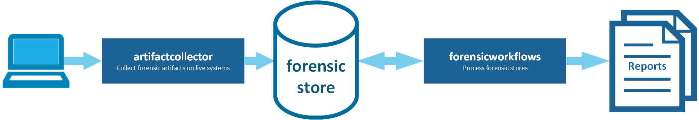

<h1 align="center">forensicstore</h1>

<p  align="center">
 <a href="https://github.com/forensicanalysis/forensicstore/actions"></a>
 <a href="https://codecov.io/gh/forensicanalysis/forensicstore"></a>
 <a href="https://goreportcard.com/report/github.com/forensicanalysis/forensicstore"></a>
 <a href="https://pkg.go.dev/github.com/forensicanalysis/forensicstore"></a>
</p>





The forensicstore project contains Go packages and Python libraries to create,
access and process forensic artifacts bundled in so called forensicstores
(a database for metadata and subfolders with forensic artifacts).

## The forensicstore format
The forensicstore format implements the following conventions:

- The forensicstore is a folder containing an item.db file and an arbitrary number of other folders.
- The item.db file contains metadata for all extracted artifacts in a forensic investigation in jsonlite format (flattened json objects in a sqlite database).
- Items are represented as json objects.
- Items are valid STIX 2.0 Observable Objects where applicable.
- Files stored in the forensicstore are referenced by item attributes ending in _path, e.g. export_path, stdout_path and wmi_path.
- Any item stored in the forensicstore can have an errors attribute that contains errors that are related to retrival or pro-cessing of this item.
## Structure
An example directory structure for a forensicstore:

```
example.forensicstore/
├── ChromeCache
│   ├── 0003357376fd75df_0
│   └── ...
├── ChromeHistory
│   └── History
├── ...
└── item.db
```


## Python library

<!--
### Installation

Python installation can be easily done via pip:

```bash
pip install forensicstore
```
-->

### Usage

```python
import forensicstore

if __name__ == '__main__':
    store = forensicstore.connect("example1.forensicstore")
    store.insert({"type": "file", "name": "test.txt"})
    store.close()
```

<!--
The full documentation can be found in [the documentation](TODO).
-->

## Go package

### Installation


```bash
go get -u github.com/forensicanalysis/forensicstore
```


### Example Code


```go
package main

import (
	"fmt"
	"github.com/forensicanalysis/forensicstore/goforensicstore"
)

func main() {
	// create forensicstore
	store, _ := goforensicstore.NewJSONLite("example.forensicstore")

	// create a struct
	evidence := struct {
		Data string
		Type string
	}{Data: "secret", Type: "test"}

	// insert struct into forensicstore
	id, _ := store.InsertStruct(evidence)

	// get item from forensicstore
	item, _ := store.Get(id)

	// access item's data
	fmt.Println(item["data"])
}

```

## Contact

For feedback, questions and discussions you can use the [Open Source DFIR Slack](https://github.com/open-source-dfir/slack). [How to get an invite](https://github.com/google/timesketch/blob/master/docs/Community-Guide.md).

## Acknowledgment

The development of this software was partially sponsored by Siemens CERT, but
is not an official Siemens product.
